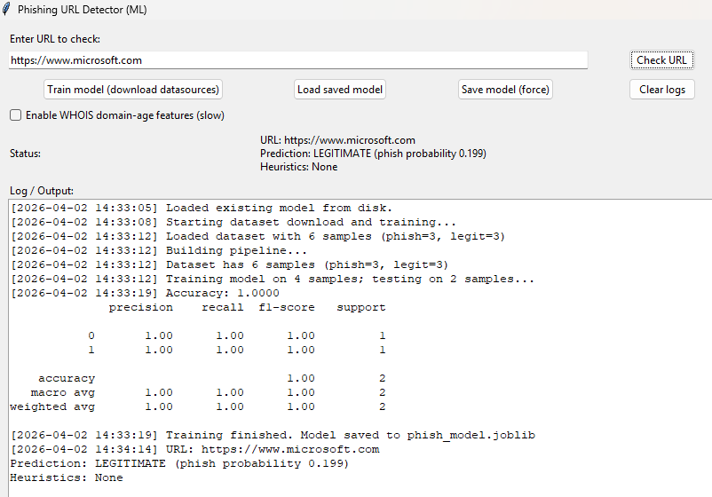

# 🔐 Intelligent Phishing URL Detection System

## 📌 Project Overview

This project is a Machine Learning-based system designed to detect phishing URLs and protect users from cyber threats. It analyzes URL patterns, lexical features, and textual data to classify whether a URL is **phishing or legitimate**.

The system includes a user-friendly GUI built with Tkinter that allows real-time URL checking, model training, and result visualization.

---

## 🎯 Features

### 🔍 Real-time URL Detection

Check whether a URL is phishing or legitimate instantly.

### 🤖 Machine Learning Model

Uses an ensemble of models:

* Logistic Regression
* Random Forest
* Support Vector Machine (SVM)
* XGBoost (if available)

### 🧠 Feature Engineering

* TF-IDF based textual features
* Lexical URL features (length, symbols, keywords)
* Domain-based analysis

### 💻 GUI Interface

Simple and interactive Tkinter-based interface.

### 💾 Model Persistence

Save and load trained models using Joblib.

### ⚖️ Class Imbalance Handling

Uses resampling and class weights for better accuracy.

---

## 🛠️ Tech Stack

* **Language:** Python
* **Libraries:** Scikit-learn, Pandas, NumPy
* **GUI:** Tkinter
* **ML Techniques:** Ensemble Learning
* **Feature Engineering:** TF-IDF + Lexical Analysis
* **Model Storage:** Joblib

---

## 📂 Project Structure

```
📦 phishing-url-detector

┣ 📜 phish_detector_gui.py        # Main application (GUI + ML)
┣ 📜 phish_model.joblib          # Trained ML model
┣ 📜 requirements.txt            # Dependencies
┣ 📜 README.md                   # Project documentation
┣ 📁 docs/
┃   ┗ 📜 project_presentation.pptx
┗ 📁 images/
    ┗ 📜 legitimate.png
    ┗ 📜 Phished.png
```

---

## 🚀 How to Run

### 1️⃣ Install Dependencies

```bash
pip install -r requirements.txt
```

### 2️⃣ Run the Application

```bash
python phish_detector_gui.py
```

### 3️⃣ Train the Model

* Click **"Train Model"** in GUI
* Wait for training to complete

---

## 📸 Screenshots

### 🖥️ Legitimate URL



### 🖥️ Phished URL


---

## 📈 Skills Demonstrated

* Machine Learning model development
* Feature engineering for cybersecurity
* GUI development using Tkinter
* Data preprocessing & handling imbalance
* Model evaluation & optimization

---

## ⚠️ Limitations

* Requires internet for dataset download
* WHOIS feature may be slow
* Model accuracy depends on dataset quality
* GUI-based system (not web deployed)

---

## 🔮 Future Improvements

* Deploy as a web application (Flask/Django)
* Add real-time browser extension
* Improve model with deep learning
* Integrate API-based phishing databases
* Add URL reputation scoring system

---

## 📬 Contact

**Name:** Akshay Kumar
**GitHub:** https://github.com/akshy24kumar-sketch

---

⭐ If you found this project useful, consider giving it a star!
